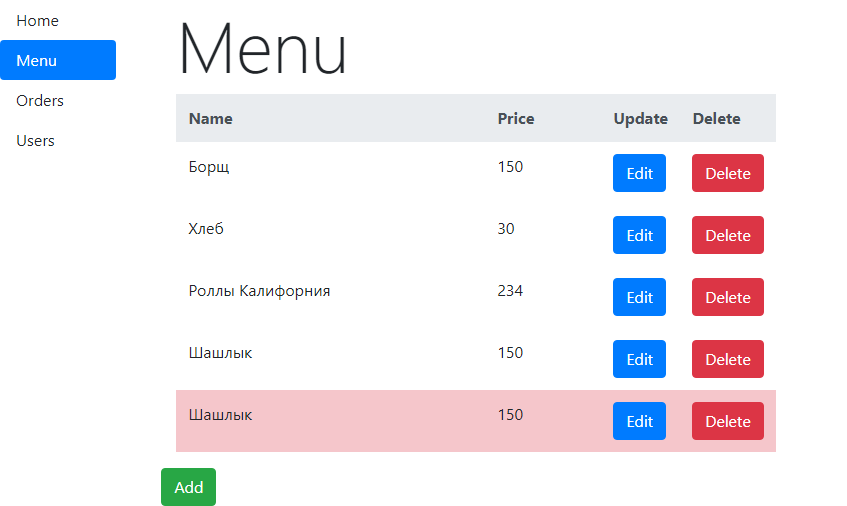
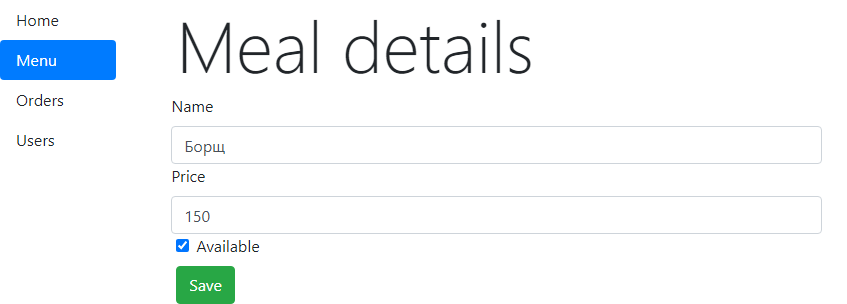
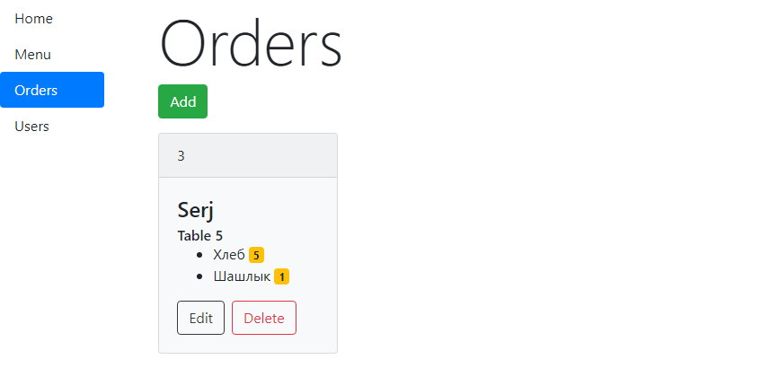
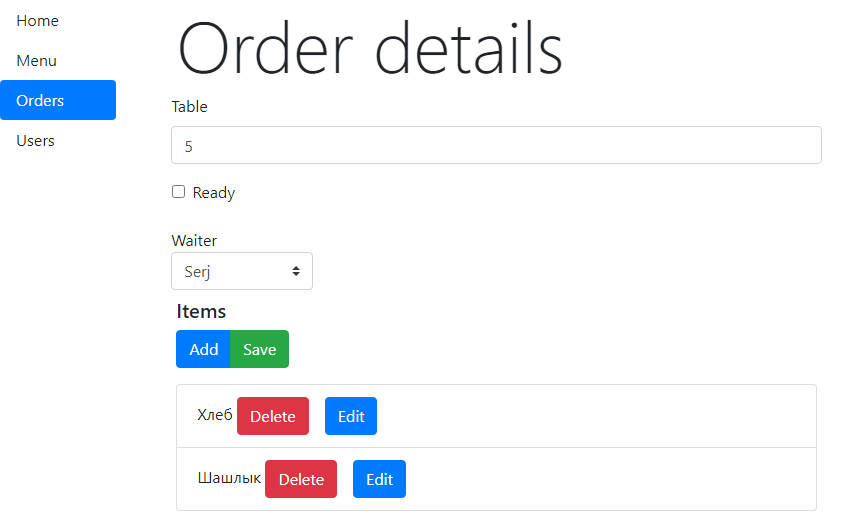
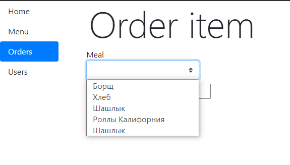
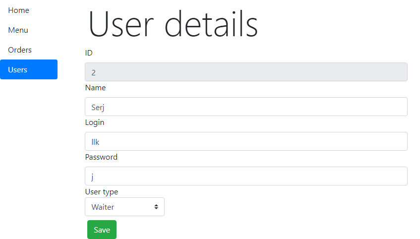

# RESTaurant Companion (client)

Client for [RESTaurant Companion](https://github.com/SirojiddinSaidmurodov/RESTaurantCompanion-server)

## Previews

### Main page


### Menu



### Menu item adding



### Orders



### Order adding



### Order item adding



### User adding



## Project setup

```
npm install
```

#### Compiles and hot-reloads for development

```
npm run serve
```

#### Compiles and minifies for production
```
npm run build
```